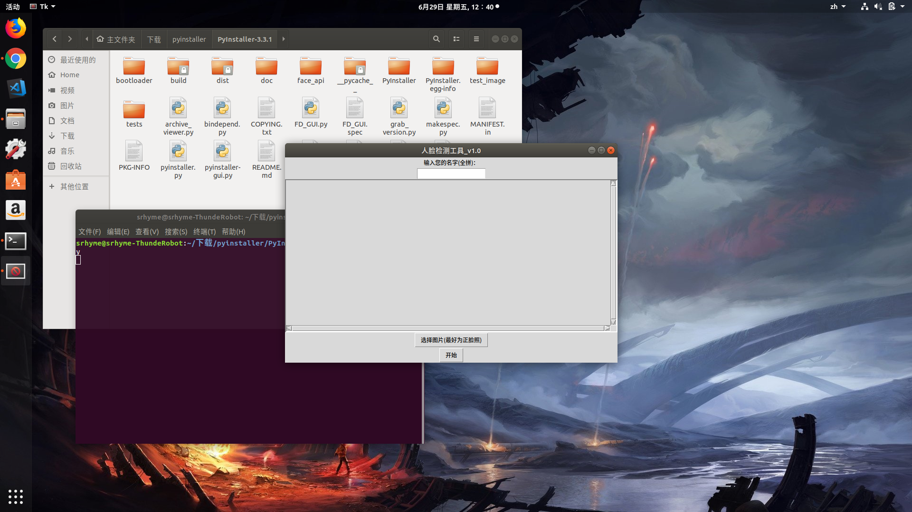
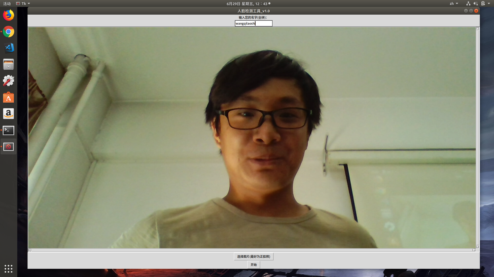
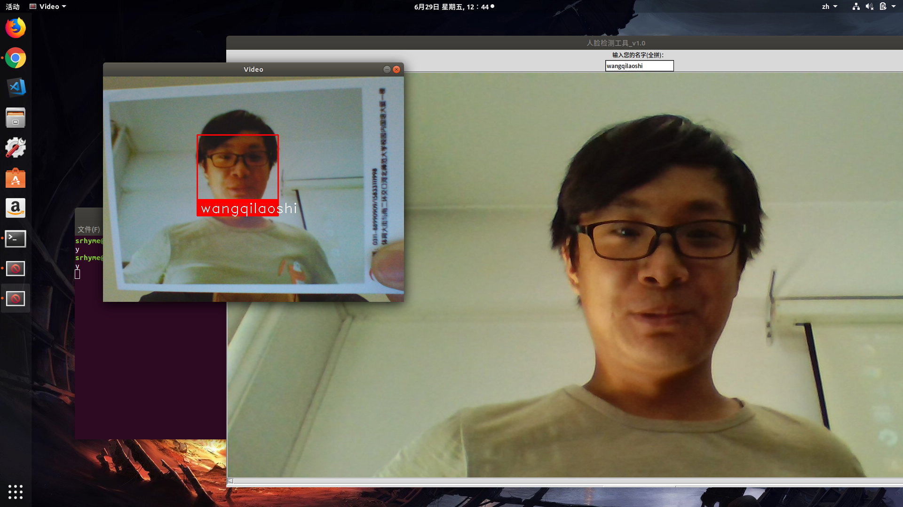
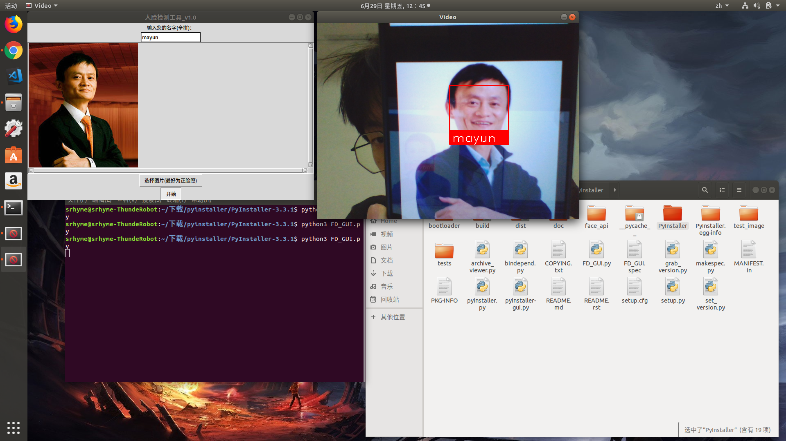
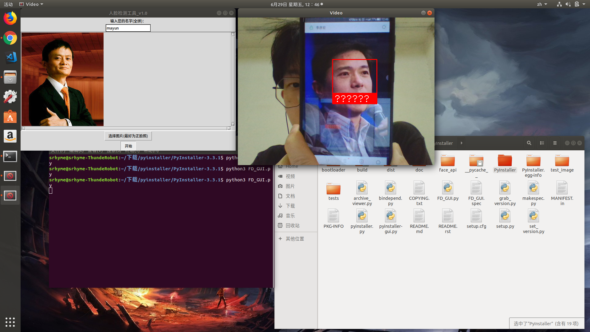

# Face-Detection 全脸检测系统

### 项目简介

**Face-Detection 全脸检测系统**是一款面向大学生的二手交易app。每一所大学都像是城市里的一座岛，学校里的大学生是岛上的居民，大学生的二手交易称之为买卖，于是有了——岛买岛卖。

岛买岛卖旨在为大学生提供一个方便，快捷的二手交易平台，如今大学生同校二手交易主要运用QQ作为媒介发布消息，消息浏览不便且信息更新不及时，过程繁琐。岛买岛卖采用了一种新型独特的商品展示方式，以地图为载体，在卖家发布商品的地点直接展示商品，商品信息浏览更加方便直观，商品信息实时更新，除了有新型地图页商品展示方式，传统的列表显示方式依然存在。岛买岛卖还实现了实时聊天的功能，使双方的交易更加方便、快捷。

### 项目成员

* 张宝奇 (项目经理，算法开发) 
    * Email: <578392883@qq.com>
    * Github : [https://github.com/zh-bq](https://github.com/zh-bq)
* 王书韵 (GUI设计，算法开发) 
    * Email: <1085532005@qq.com>
    * Github : [https://github.com/wangsy1](https://github.com/wangsy1)
    
### 运行效果

